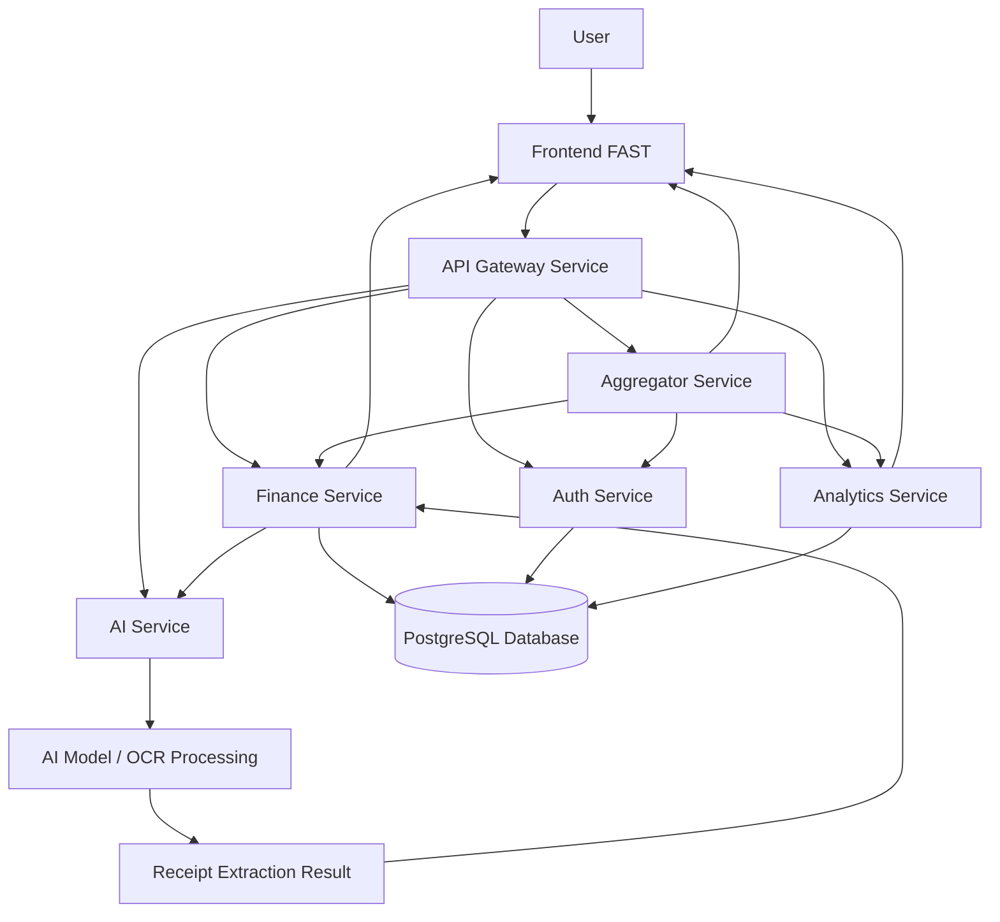

# 🚀 FASTWorks

## FAST: Financial Analysis & Smart Tracking

Selamat datang di **FASTWorks**, organisasi GitHub yang digunakan sebagai pusat pengelolaan pengembangan proyek **FAST (Financial Analysis & Smart Tracking)**.

FAST adalah platform manajemen keuangan yang membantu pengguna mencatat transaksi, memantau kondisi keuangan, membaca struk belanja secara otomatis, dan menampilkan informasi keuangan dalam bentuk dashboard yang mudah dipahami. Proyek ini dikembangkan secara kolaboratif dengan pembagian peran yang jelas, mulai dari Data Engineer, Data Analyst, Model Builder, API Builder, Frontend Developer, hingga Backend Developer.

Organisasi FASTWorks dibuat agar seluruh repository proyek dapat tersusun secara rapi, terpusat, dan mudah dikelola oleh seluruh anggota tim.

---

## 📌 Ringkasan Proyek

FAST dikembangkan untuk menjawab kebutuhan pengguna dalam mengelola keuangan pribadi secara lebih praktis. Banyak pengguna masih mencatat transaksi secara manual, sehingga proses pencatatan sering terlewat, tidak konsisten, dan sulit dianalisis. Melalui FAST, pengguna dapat mencatat transaksi, melihat ringkasan keuangan, mengunggah struk belanja, serta memperoleh visualisasi pengeluaran secara lebih terstruktur.

Salah satu fitur utama FAST adalah **upload struk belanja**. Melalui fitur ini, pengguna dapat mengunggah gambar struk, kemudian sistem akan memproses gambar tersebut menggunakan layanan AI untuk membantu ekstraksi informasi transaksi. Data hasil ekstraksi dapat digunakan sebagai dasar pencatatan pengeluaran pada aplikasi.

---

## 🎯 Tujuan Pengembangan

Tujuan utama pengembangan FAST adalah membangun aplikasi manajemen keuangan yang dapat membantu pengguna memahami kondisi finansial secara lebih mudah dan informatif.

Tujuan khusus dari proyek ini adalah:

- Membantu pengguna mencatat transaksi pemasukan dan pengeluaran.
- Menyediakan dashboard keuangan yang mudah dipahami.
- Menampilkan visualisasi data keuangan pengguna.
- Mengembangkan fitur upload struk belanja.
- Mengintegrasikan sistem dengan layanan AI untuk membaca informasi dari struk.
- Menyediakan API backend yang terdokumentasi.
- Mengembangkan sistem berbasis beberapa service agar lebih modular.
- Mempermudah kolaborasi tim melalui GitHub Organization.

---

## 🧩 Fitur Utama FAST

Beberapa fitur utama yang dikembangkan dalam aplikasi FAST adalah:

### 1. Autentikasi Pengguna

Fitur autentikasi digunakan untuk mengelola akses pengguna ke dalam sistem. Pengguna dapat melakukan register, login, dan mengakses fitur aplikasi sesuai data akun masing-masing.

Fitur ini mencakup:

- Register pengguna.
- Login pengguna.
- Validasi data pengguna.
- Pengelolaan token autentikasi.
- Proteksi akses halaman tertentu.

### 2. Dashboard Keuangan

Dashboard digunakan untuk menampilkan ringkasan kondisi keuangan pengguna. Melalui dashboard, pengguna dapat melihat informasi penting seperti total pemasukan, total pengeluaran, serta ringkasan transaksi.

Fitur ini mencakup:

- Ringkasan pemasukan.
- Ringkasan pengeluaran.
- Total saldo atau kondisi keuangan.
- Informasi transaksi terbaru.
- Tampilan visual yang mudah dipahami.

### 3. Manajemen Transaksi

Fitur transaksi digunakan untuk mencatat dan mengelola data keuangan pengguna. Pengguna dapat menambahkan data transaksi, melihat daftar transaksi, serta memantau riwayat pemasukan dan pengeluaran.

Fitur ini mencakup:

- Tambah transaksi.
- Lihat daftar transaksi.
- Pengelompokan transaksi berdasarkan kategori.
- Pengelolaan pemasukan dan pengeluaran.
- Riwayat transaksi pengguna.

### 4. Upload Struk Belanja

Fitur upload struk memungkinkan pengguna mengunggah gambar struk belanja ke dalam sistem. Gambar tersebut kemudian dapat diproses untuk membantu menghasilkan data transaksi secara lebih otomatis.

Fitur ini mencakup:

- Upload gambar struk.
- Validasi file gambar.
- Pengiriman gambar ke layanan backend atau AI.
- Pemrosesan hasil ekstraksi struk.
- Penyimpanan data hasil pembacaan struk.

### 5. Visualisasi Keuangan

Visualisasi keuangan digunakan untuk membantu pengguna memahami pola pengeluaran dan pemasukan. Data keuangan disajikan dalam bentuk grafik atau komponen visual agar lebih mudah dianalisis.

Fitur ini mencakup:

- Grafik pemasukan dan pengeluaran.
- Visualisasi kategori transaksi.
- Ringkasan data keuangan.
- Insight sederhana berdasarkan data transaksi.

### 6. Integrasi AI

Integrasi AI digunakan untuk mendukung proses pembacaan struk belanja. Layanan AI membantu sistem mengenali informasi dari gambar struk, seperti nama toko, daftar item, harga, dan total transaksi.

Fitur ini mencakup:

- Pemrosesan gambar struk.
- OCR atau ekstraksi teks dari gambar.
- Deteksi informasi transaksi.
- Integrasi hasil AI ke sistem FAST.

---

## 📚 Dokumentasi Utama Proyek

Dokumentasi berikut digunakan sebagai acuan utama dalam pengembangan proyek FAST.

### 📄 Project Plan FAST

Dokumen Project Plan berisi penjelasan mengenai latar belakang proyek, tujuan, ruang lingkup, pembagian role, rencana kerja, dan strategi pengembangan produk.

**Tautan:**  
[Project Plan FAST](https://drive.google.com/file/d/14It28PvqEahSLEqCFheELVlNZXOHfdlK/view?usp=sharing)

---

### 📅 Project Timeline & Master Schedule

Dokumen timeline berisi jadwal pengerjaan proyek, pembagian tugas, estimasi waktu pengerjaan, dan perkembangan pekerjaan setiap role.

**Tautan:**  
[Project Timeline & Master Schedule](https://docs.google.com/spreadsheets/d/1p4zBMDv3_BixCXLZQkPSwcF3f4M7LWHYst3qS-99BnM/edit?gid=0#gid=0)

---

### 📑 Software Requirements Specification (SRS)

Dokumen SRS menjelaskan kebutuhan sistem secara detail, mulai dari kebutuhan fungsional, kebutuhan non-fungsional, rancangan sistem, spesifikasi fitur, hingga kebutuhan teknis aplikasi.

**Tautan:**  
[Software Requirements Specification (SRS)](https://drive.google.com/file/d/1TPe2PsL4dN3re9pC7aJaZ0TslmRzbJ2s/view?usp=drive_link)

---

### 🔄 Sequence Diagram FAST

Sequence Diagram digunakan untuk menggambarkan alur komunikasi antar komponen sistem, seperti frontend, backend, API Gateway, service, database, dan AI service.

**Tautan:**  
[Interactive Sequence Diagram](https://hmyid2.github.io/sequence-diagram-fast/)

---

## 🏢 GitHub Organization

Seluruh source code proyek FAST dikelola melalui GitHub Organization dengan nama **FASTWorks**.

**Tautan GitHub Organization:**  
[https://github.com/FASTWorks/](https://github.com/FASTWorks/)

Penggunaan GitHub Organization bertujuan agar pengelolaan repository dapat dilakukan secara terstruktur oleh seluruh anggota tim. Setiap bagian pengembangan, seperti frontend, backend, data science, AI service, dan dokumentasi, dapat dipisahkan ke dalam repository yang sesuai dengan fungsinya.

---

## 🏗️ Struktur Repository FASTWorks

Organisasi FASTWorks terdiri dari beberapa repository utama yang saling terhubung.

```text
FASTWorks
├── fst-frontend
├── fst-backend
├── fst-gateway-service
├── fst-auth-service
├── fst-finance-service
├── fst-analytics-service
├── fst-aggregator-service
├── fst-ai-service
├── fst-data-science
└── fst-ai-engineer
```

---

## 🌐 Frontend

### Repository: fst-frontend

Repository frontend digunakan untuk membangun tampilan aplikasi FAST yang berinteraksi langsung dengan pengguna.

**Tautan Repository:**  
[fst-frontend](https://github.com/FASTWorks/fst-frontend)

### Tanggung Jawab Frontend

Frontend bertanggung jawab dalam membangun seluruh tampilan aplikasi, memastikan tampilan responsif, serta menghubungkan antarmuka pengguna dengan API backend.

### Fitur Frontend

- Halaman login.
- Halaman register.
- Halaman dashboard.
- Halaman transaksi.
- Halaman visualisasi keuangan.
- Halaman upload struk.
- Integrasi API.
- Responsive design.
- Pengelolaan state dan error pada UI.

### Status Frontend

✅ **Selesai**

Frontend telah membangun tampilan aplikasi FAST, seperti halaman login, dashboard, transaksi, visualisasi keuangan, dan fitur upload struk. Tampilan juga sudah dibuat responsif agar dapat digunakan pada berbagai ukuran layar. Selain itu, frontend telah diintegrasikan dengan API untuk menampilkan hasil proses dari sistem.

Perkiraan penyelesaian: **Week 2–Week 6**, sekitar **29 April–29 Mei**.

---

## ⚙️ Backend & Microservices

Backend FAST dikembangkan dengan pendekatan modular melalui beberapa service. Setiap service memiliki tanggung jawab masing-masing agar sistem lebih mudah dikembangkan, diuji, dan dipelihara.

---

### Repository: fst-backend

Repository ini digunakan sebagai pusat pengelolaan backend FAST.

**Tautan Repository:**  
[fst-backend](https://github.com/FASTWorks/fst-backend)

### Fungsi Utama

- Mengelola struktur backend.
- Mengatur integrasi antar service.
- Menjadi repository utama backend.
- Mengelola konfigurasi backend.
- Mendukung proses testing dan deployment backend.

---

### Repository: fst-gateway-service

Repository ini digunakan sebagai API Gateway yang menjadi pintu utama komunikasi antara frontend dan service backend.

**Tautan Repository:**  
[fst-gateway-service](https://github.com/FASTWorks/fst-gateway-service)

### Fungsi Utama

- Menerima request dari frontend.
- Meneruskan request ke service yang sesuai.
- Mengatur routing API.
- Menjadi pusat akses endpoint backend.
- Menyediakan dokumentasi API.

---

### Repository: fst-auth-service

Repository ini digunakan untuk mengelola autentikasi dan otorisasi pengguna.

**Tautan Repository:**  
[fst-auth-service](https://github.com/FASTWorks/fst-auth-service)

### Fungsi Utama

- Register pengguna.
- Login pengguna.
- Verifikasi akun.
- Validasi token.
- Manajemen data pengguna.
- Proteksi endpoint tertentu.

---

### Repository: fst-finance-service

Repository ini digunakan untuk mengelola data keuangan pengguna.

**Tautan Repository:**  
[fst-finance-service](https://github.com/FASTWorks/fst-finance-service)

### Fungsi Utama

- Mengelola data transaksi.
- Mengelola pemasukan.
- Mengelola pengeluaran.
- Mengelola kategori transaksi.
- Menyediakan data keuangan untuk dashboard.
- Menghubungkan data transaksi dengan hasil ekstraksi struk.

---

### Repository: fst-analytics-service

Repository ini digunakan untuk menganalisis data keuangan pengguna.

**Tautan Repository:**  
[fst-analytics-service](https://github.com/FASTWorks/fst-analytics-service)

### Fungsi Utama

- Menghitung ringkasan keuangan.
- Menganalisis pola pemasukan dan pengeluaran.
- Menyediakan data insight.
- Mendukung visualisasi data pada dashboard.
- Mengolah data transaksi menjadi informasi yang lebih mudah dipahami.

---

### Repository: fst-aggregator-service

Repository ini digunakan untuk menggabungkan data dari beberapa service agar frontend dapat menerima data yang lebih siap ditampilkan.

**Tautan Repository:**  
[fst-aggregator-service](https://github.com/FASTWorks/fst-aggregator-service)

### Fungsi Utama

- Mengambil data dari beberapa service.
- Menggabungkan data untuk kebutuhan dashboard.
- Mengurangi kompleksitas request dari frontend.
- Menyediakan response data yang lebih terstruktur.
- Mempermudah frontend dalam menampilkan informasi gabungan.

---

## 🧠 AI & Data Science

Bagian AI dan Data Science bertanggung jawab dalam pengelolaan dataset, analisis data, pengembangan model, dan integrasi layanan AI dengan sistem FAST.

---

### Repository: fst-data-science

Repository ini digunakan untuk proses eksplorasi data, data preparation, dan analisis dataset.

**Tautan Repository:**  
[fst-data-science](https://github.com/FASTWorks/fst-data-science)

### Fungsi Utama

- Data gathering.
- Data preparation.
- Data cleaning.
- Exploratory Data Analysis.
- Visualisasi data.
- Preprocessing dataset.
- Penyusunan insight awal.
- Dokumentasi hasil analisis data.

### Status Data Engineer

✅ **Selesai**

Data Engineer telah menyelesaikan proses pengumpulan dataset, data preparation, pembersihan data, serta pembagian dataset untuk kebutuhan model. Pekerjaan selesai pada **Week 1–Week 2**, sekitar **20 April–30 April**.

### Status Data Analyst

✅ **Selesai**

Data Analyst telah melakukan EDA, analisis pola data, visualisasi, serta penyusunan insight awal sebagai dasar preprocessing dan pengembangan sistem. Pekerjaan selesai pada **Week 2–Week 3**, sekitar **23 April–6 Mei**.

---

### Repository: fst-ai-engineer

Repository ini digunakan untuk proses pengembangan model AI.

**Tautan Repository:**  
[fst-ai-engineer](https://github.com/FASTWorks/fst-ai-engineer)

### Fungsi Utama

- Inisialisasi environment model.
- Desain model.
- Implementasi model CNN.
- Training model.
- Monitoring performa model.
- Evaluasi model.
- Export model.
- Penyusunan pipeline inference.

### Status Model Builder

✅ **Selesai**

Model Builder telah membangun pipeline model AI, melakukan implementasi model CNN, training, monitoring performa, dan export model. Model yang dihasilkan digunakan sebagai komponen utama untuk mendukung proses deteksi dan ekstraksi informasi dari struk belanja. Pekerjaan selesai pada **Week 1–Week 4**, sekitar **20 April–15 Mei**.

---

### Repository: fst-ai-service

Repository ini digunakan sebagai layanan AI yang dapat diakses oleh sistem backend.

**Tautan Repository:**  
[fst-ai-service](https://github.com/FASTWorks/fst-ai-service)

### Fungsi Utama

- Menyediakan API untuk pemrosesan gambar struk.
- Menghubungkan backend dengan model AI.
- Menjalankan proses OCR atau ekstraksi informasi.
- Menghasilkan data hasil ekstraksi dari gambar struk.
- Mengembalikan hasil pemrosesan ke backend.

### Status API Builder

✅ **Selesai**

API Builder telah membangun API menggunakan FastAPI, membuat schema, validasi input, REST API, integrasi model AI, dan dokumentasi API. API ini digunakan sebagai penghubung antara sistem frontend, backend, dan model AI. Pekerjaan selesai pada **Week 1–Week 4**, sekitar **20 April–15 Mei**.

---

## 🗺️ Arsitektur Sistem

FAST menggunakan pendekatan sistem modular. Frontend digunakan sebagai antarmuka pengguna. API Gateway digunakan sebagai pintu masuk request. Backend services mengelola proses bisnis dan data. AI service digunakan untuk memproses gambar struk dan menghasilkan data transaksi.



---

## 🔄 Alur Kerja End-to-End Sistem

Berikut adalah alur kerja end-to-end sistem FAST dari sisi pengguna hingga pemrosesan data.

### 1. Pengguna Mengakses Aplikasi

Pengguna membuka aplikasi FAST melalui tautan deployment frontend. Aplikasi akan menampilkan halaman awal, kemudian pengguna dapat melakukan login atau register.

### 2. Proses Autentikasi

Ketika pengguna melakukan login atau register, frontend akan mengirimkan data ke API Gateway. API Gateway meneruskan request ke Auth Service. Auth Service memvalidasi data pengguna dan mengembalikan response ke frontend.

### 3. Pengguna Mengakses Dashboard

Setelah berhasil masuk, pengguna dapat melihat dashboard keuangan. Frontend mengambil data melalui API Gateway, kemudian request diteruskan ke service yang sesuai, seperti Finance Service, Analytics Service, atau Aggregator Service.

### 4. Pengguna Mencatat Transaksi

Pengguna dapat menambahkan transaksi pemasukan atau pengeluaran. Data transaksi dikirim dari frontend ke backend, kemudian disimpan ke database melalui Finance Service.

### 5. Pengguna Mengunggah Struk

Jika pengguna mengunggah gambar struk, frontend mengirim file gambar ke backend atau AI service melalui API yang tersedia. Gambar tersebut diproses untuk mengekstraksi informasi transaksi.

### 6. AI Memproses Struk

AI Service memproses gambar struk menggunakan model atau pipeline OCR. Hasil pemrosesan dapat berupa teks atau data transaksi yang telah diekstraksi dari struk.

### 7. Hasil Ekstraksi Digunakan sebagai Data Transaksi

Data hasil ekstraksi dikirim kembali ke backend, kemudian dapat digunakan sebagai data transaksi pengguna. Sistem dapat menyimpan data tersebut agar muncul pada daftar transaksi atau dashboard.

### 8. Data Dianalisis

Analytics Service mengolah data transaksi untuk menghasilkan ringkasan, insight, dan visualisasi yang membantu pengguna memahami kondisi keuangan.

### 9. Frontend Menampilkan Hasil

Frontend menampilkan data transaksi, dashboard, grafik, dan hasil ekstraksi struk kepada pengguna dalam tampilan yang rapi dan responsif.

---

## 🛠️ Teknologi yang Digunakan

### Frontend

- JavaScript
- React
- Next.js
- Tailwind CSS
- Responsive Design
- Vercel

### Backend

- Node.js
- Express.js
- TypeScript
- REST API
- JWT Authentication
- Middleware
- Error Handling
- Railway

### Database

- PostgreSQL
- Prisma ORM
- Database Migration
- Relational Database Design

### AI & Data Science

- Python
- FastAPI
- Pandas
- NumPy
- Matplotlib
- OpenCV
- OCR
- Machine Learning
- Deep Learning
- CNN Model
- Model Training
- Model Evaluation

### Tools Kolaborasi

- Git
- GitHub
- GitHub Organization
- GitHub Pull Request
- Docker
- Docker Compose
- Google Drive
- Google Docs
- Google Sheets

---

## 🚀 Tautan Deployment Produk

Produk FAST telah dilakukan deployment agar dapat diakses dan diuji secara langsung melalui internet.

### Frontend

Frontend digunakan sebagai tampilan utama aplikasi yang dapat diakses oleh pengguna.

**Tautan:**  
[https://fst-frontend-omega.vercel.app](https://fst-frontend-omega.vercel.app)

### Backend API Documentation

Backend API Docs digunakan untuk melihat dokumentasi endpoint yang tersedia pada sistem backend.

**Tautan:**  
[https://fst-gateway-service-production.up.railway.app/api-docs](https://fst-gateway-service-production.up.railway.app/api-docs)

---

## 📊 Dataset dan Data Hasil Ekstraksi

Dataset yang digunakan dalam proyek ini berasal dari platform Roboflow berupa dataset struk belanja. Dataset tersebut digunakan sebagai sumber data utama dalam proses deteksi dan ekstraksi informasi dari gambar struk belanja.

### Tautan Dataset Struk Belanja

- [Dataset OCR Struk Belanja 1](https://universe.roboflow.com/ocr-struk-belanja-gpcd0/ocr-struk-belanja-mx7qi)
- [Dataset Deteksi Struk Belanja 2](https://universe.roboflow.com/mercury-nxonz/deteksi-struk-belanja-cc8mm)

### Data Hasil Ekstraksi

Data hasil ekstraksi yang telah diproses disimpan dalam folder Google Drive. Folder ini berisi hasil keluaran dari proses ekstraksi data struk belanja yang digunakan untuk kebutuhan analisis dan pengembangan sistem.

**Tautan:**  
[Data Hasil Ekstraksi FAST](https://drive.google.com/drive/folders/1uOldgquHZnxtFNy8EnTbptM4k7eFdS?usp=sharing)

---

## 📌 Status Pengerjaan Role

Berikut adalah ringkasan status pengerjaan berdasarkan role pada proyek FAST.

| No. | Role | Status | Keterangan |
|---|---|---|---|
| 1 | Data Engineer | ✅ Selesai | Telah melakukan pengumpulan dataset struk belanja, memahami struktur data, melakukan data preparation, pembersihan data, serta pembagian dataset untuk kebutuhan pengembangan model. Proses ini juga mencakup penyusunan pipeline awal agar dataset siap digunakan oleh tim AI. Pekerjaan selesai pada Week 1–Week 2, sekitar 20 April–30 April. |
| 2 | Data Analyst | ✅ Selesai | Telah melakukan Exploratory Data Analysis, menganalisis pola data, membuat visualisasi, dan menyusun insight awal. Hasil analisis digunakan sebagai dasar dalam proses preprocessing dan pengembangan fitur sistem. Pekerjaan selesai pada Week 2–Week 3, sekitar 23 April–6 Mei. |
| 3 | Model Builder | ✅ Selesai | Telah membangun pipeline model AI, mulai dari inisialisasi environment, desain model, implementasi model CNN, proses training, monitoring performa, evaluasi, hingga export model. Model digunakan untuk mendukung proses deteksi dan ekstraksi informasi dari struk belanja. Pekerjaan selesai pada Week 1–Week 4, sekitar 20 April–15 Mei. |
| 4 | API Builder | ✅ Selesai | Telah membangun layanan API menggunakan FastAPI, mulai dari inisialisasi API, validasi input dan schema, pembuatan REST API, integrasi dengan model AI, hingga penyusunan dokumentasi API. API ini menjadi penghubung antara sistem utama dan layanan AI. Pekerjaan selesai pada Week 1–Week 4, sekitar 20 April–15 Mei. |
| 5 | Frontend | ✅ Selesai | Telah membangun tampilan aplikasi FAST, seperti halaman login, dashboard, transaksi, visualisasi keuangan, dan fitur upload struk. Tampilan sudah dibuat responsif agar dapat digunakan pada berbagai ukuran layar. Frontend juga telah diintegrasikan dengan API untuk menampilkan data dari sistem. Pekerjaan selesai pada Week 2–Week 6, sekitar 29 April–29 Mei. |
| 6 | Backend | ✅ Selesai | Telah membangun struktur backend aplikasi, mulai dari setup backend, middleware, desain database, integrasi database, RESTful API, validasi, error handling, endpoint CRUD, dokumentasi API, integrasi AI API, testing, hingga deployment backend. Pekerjaan selesai pada Week 2–Week 6, sekitar 29 April–29 Mei. |

---

## 🧪 Testing dan Evaluasi

Testing dilakukan untuk memastikan setiap bagian sistem berjalan sesuai kebutuhan. Pengujian dilakukan pada frontend, backend, API, integrasi AI, dan deployment.

### Fokus Pengujian

- Pengujian tampilan frontend.
- Pengujian validasi form.
- Pengujian endpoint backend.
- Pengujian API menggunakan dokumentasi API.
- Pengujian upload struk.
- Pengujian integrasi frontend dan backend.
- Pengujian integrasi backend dan AI service.
- Pengujian hasil deployment.

### Hasil Umum

Secara umum, seluruh role telah menyelesaikan tugas utama berdasarkan rencana proyek. Sistem telah memiliki frontend, backend, API, layanan AI, dataset, dokumentasi, dan tautan deployment yang dapat digunakan untuk proses demonstrasi produk.

---

## 👥 Pembagian Role Tim

| Role | Tanggung Jawab |
|---|---|
| Data Engineer | Mengumpulkan dataset, memahami struktur data, membersihkan data, dan menyiapkan dataset untuk proses model |
| Data Analyst | Melakukan EDA, visualisasi data, analisis pola, dan menyusun insight dari dataset |
| Model Builder | Membangun model AI, melakukan training, evaluasi, dan export model |
| API Builder | Membuat API untuk integrasi model AI dengan sistem utama |
| Frontend Developer | Membangun tampilan aplikasi, halaman utama, dashboard, transaksi, dan integrasi API |
| Backend Developer | Membangun backend service, database, endpoint API, middleware, error handling, dan deployment backend |

---

## 📖 Panduan Kontribusi

Panduan ini digunakan oleh anggota tim saat ingin mengembangkan fitur atau memperbarui repository.

### 1. Clone Repository

```bash
git clone https://github.com/FASTWorks/nama-repository.git
cd nama-repository
```

### 2. Buat Branch Baru

```bash
git checkout -b feat/nama-fitur
```

### 3. Lakukan Perubahan

Lakukan perubahan sesuai task masing-masing role.

### 4. Tambahkan File yang Berubah

```bash
git add .
```

### 5. Commit Perubahan

```bash
git commit -m "feat: menambahkan nama fitur"
```

### 6. Push ke GitHub

```bash
git push origin feat/nama-fitur
```

### 7. Buat Pull Request

Setelah push, buat Pull Request ke branch utama agar perubahan dapat direview sebelum digabungkan.

---

## 📦 Cara Menjalankan Project Secara Umum

Setiap repository memiliki konfigurasi masing-masing. Namun, secara umum project dapat dijalankan dengan langkah berikut.

### Frontend

```bash
cd fst-frontend
npm install
npm run dev
```

### Backend Node.js Service

```bash
cd nama-service
npm install
npm run dev
```

### AI Service FastAPI

```bash
cd fst-ai-service
pip install -r requirements.txt
uvicorn app.main:app --reload
```

### Data Science Notebook

```bash
cd fst-data-science
jupyter notebook
```

---

## 🔐 Environment Variable

Setiap repository dapat memiliki file `.env` untuk menyimpan konfigurasi penting. File `.env` tidak boleh diunggah ke repository publik.

Contoh konfigurasi umum:

```env
DATABASE_URL=
JWT_SECRET=
PORT=
API_GATEWAY_URL=
AI_SERVICE_URL=
NEXT_PUBLIC_API_URL=
```

---

## ⚠️ Catatan Penting

- Jangan mengunggah file `.env` ke GitHub.
- Jangan menyimpan token rahasia langsung di source code.
- Gunakan branch berbeda untuk setiap fitur.
- Gunakan Pull Request sebelum merge.
- Perbarui dokumentasi jika ada perubahan fitur.
- Pastikan endpoint API sudah diuji sebelum digunakan frontend.
- Pastikan dataset dan model disimpan pada lokasi yang sesuai.

---

## 🧾 Ringkasan Deliverables

Deliverables utama dari proyek FAST meliputi:

- Project Plan.
- Project Timeline.
- Software Requirements Specification.
- Sequence Diagram.
- Source code frontend.
- Source code backend.
- Source code AI service.
- Dataset struk belanja.
- Data hasil ekstraksi.
- Deployment frontend.
- Deployment backend API docs.
- Dokumentasi GitHub Organization.
